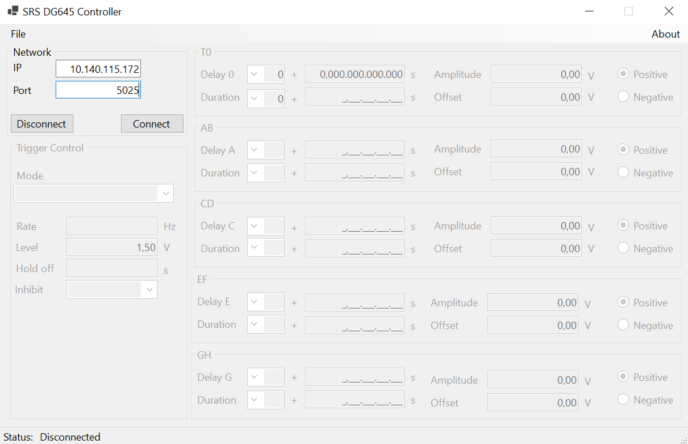

# DG645 Control App

App coded in C#.net for controlling the Digital Delay Generator DG645
used on experiments.

https://www.thinksrs.com/products/dg645.html

Basic functions are coded such as:

Trigger controls:
* Mode
* Rate
* Inhibit

Channel controls:
* Delay
* Duration
* Amplitude
* Offset
* Edge: Negative or positive

For more specific functions, please configure the equipment manually until
this funcitons is implemented.

--- 
## Installation

**Requirements:** To run this app, it is required a .net runtime ver. > 6.

**Running the application:** Unzip the file published-executable.zp and run the executable file.

Note: No further installation is required!

---
## Credits
**Felipe C. Salgado**

